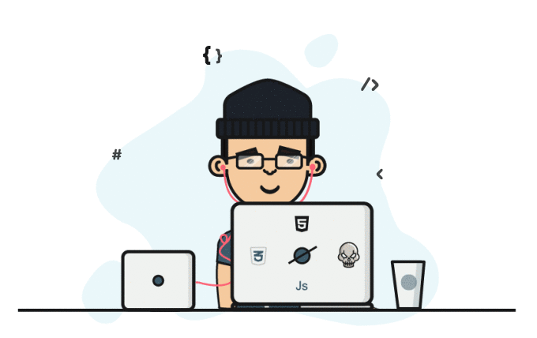
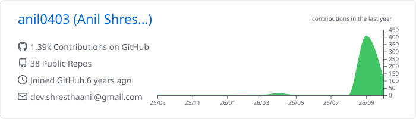
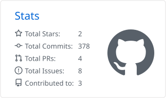
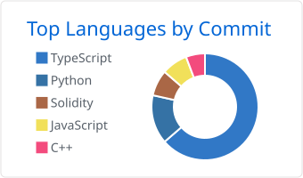

<h1 align="center">Anil Shrestha</h1>

  <b>Full Stack Web Developer</b> &nbsp;·&nbsp; Next.js &nbsp;·&nbsp; React &nbsp;·&nbsp; Node.js &nbsp;·&nbsp; TypeScript

  I build web apps end to end, from the database schema to the deployed interface.

  
  
  

 

## About

- **What I do:** full stack web apps with Next.js, React, Node.js and Express
- **Data layer:** MySQL, MongoDB and Prisma ORM
- **Recently shipped:** [SajiloTools](https://sajilotools-nine.vercel.app), free browser-based PDF, image and QR tools
- **Ask me about:** Node, Express, React, Next.js, MySQL, MongoDB, Prisma
- **Reach me:** [dev.shresthaanil@gmail.com](mailto:dev.shresthaanil@gmail.com)
- **Fun fact:** I'm an introvert, so my code does most of the talking

 

## Featured projects

<table>
  <tr>
    <td width="50%" valign="top">
      <h3><a href="https://sajilotools-nine.vercel.app">SajiloTools</a></h3>
      Everyday IT tools with no sign-up: online clipboard, QR codes, PDF merge/split and image resize. Everything except the clipboard runs in the browser.
        
      <code>Next.js</code> <code>TypeScript</code> <code>Prisma</code> <code>Tailwind</code> <code>pdf-lib</code>
        
      <a href="https://sajilotools-nine.vercel.app"><b>Live site →</b></a>
    </td>
    <td width="50%" valign="top">
      <h3><a href="https://proud-nepal-store.vercel.app">Proud Nepal IT Supplies</a></h3>
      E-commerce store for a laptop retailer, with product catalog, cart and user authentication.
        
      <code>Next.js</code> <code>TypeScript</code> <code>Prisma</code> <code>Zustand</code> <code>Clerk</code>
        
      <a href="https://proud-nepal-store.vercel.app"><b>Live site →</b></a>
    </td>
  </tr>
  <tr>
    <td width="50%" valign="top">
      <h3><a href="https://streamger-site.vercel.app">Streamger</a></h3>
      Online streaming platform website.
        
      <code>Next.js</code> <code>TypeScript</code> <code>Tailwind</code>
        
      <a href="https://streamger-site.vercel.app"><b>Live site →</b></a>
    </td>
    <td width="50%" valign="top">
      <h3><a href="https://github.com/anil0403/next-auth-template-google-github">Next Auth Template</a></h3>
      Starter template for Next.js apps with Google and GitHub sign-in ready to go.
        
      <code>Next.js</code> <code>NextAuth</code> <code>Prisma</code> <code>Tailwind</code>
        
      <a href="https://nextjs-template-liart-nine.vercel.app"><b>Live site →</b></a> &nbsp;
      <a href="https://github.com/anil0403/next-auth-template-google-github"><b>Code →</b></a>
    </td>
  </tr>
</table>

## Tech stack

<table>
  <tr>
    <td><b>Languages</b></td>
    <td></td>
  </tr>
  <tr>
    <td><b>Frontend</b></td>
    <td></td>
  </tr>
  <tr>
    <td><b>Backend</b></td>
    <td></td>
  </tr>
  <tr>
    <td><b>Databases</b></td>
    <td></td>
  </tr>
  <tr>
    <td><b>Tools</b></td>
    <td> &nbsp;+ Canva</td>
  </tr>
</table>

## GitHub activity

  <picture>
    <source media="(prefers-color-scheme: dark)" srcset="./profile-summary-card-output/github_dark/0-profile-details.svg">
    
  </picture>

  <picture>
    <source media="(prefers-color-scheme: dark)" srcset="./profile-summary-card-output/github_dark/3-stats.svg">
    
  </picture>
  <picture>
    <source media="(prefers-color-scheme: dark)" srcset="./profile-summary-card-output/github_dark/2-most-commit-language.svg">
    
  </picture>

  <picture>
    <source media="(prefers-color-scheme: dark)" srcset="https://streak-stats.demolab.com/?user=anil0403&theme=github-dark-blue&hide_border=true">
    
  </picture>

  <picture>
    <source media="(prefers-color-scheme: dark)" srcset="https://raw.githubusercontent.com/anil0403/anil0403/output/github-snake-dark.svg">
    
  </picture>

## Elsewhere

  <a href="https://twitter.com/anilshrestha43">X / Twitter</a> &nbsp;·&nbsp;
  <a href="https://linkedin.com/in/anil-shrestha-6875591b5">LinkedIn</a> &nbsp;·&nbsp;
  <a href="https://fb.com/anil0403">Facebook</a> &nbsp;·&nbsp;
  <a href="https://instagram.com/anilshrestha___">Instagram</a>

  

